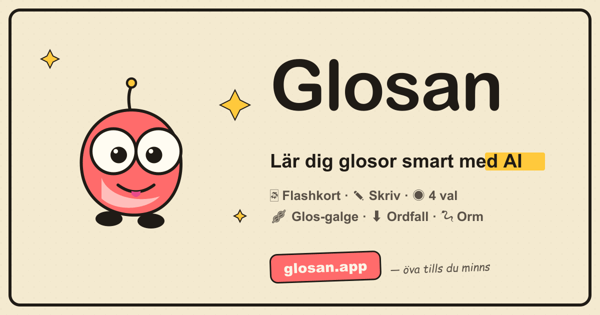

# Glosan

> Lär dig glosor smart med AI och kompis-utmaningar.

[**glosan.app**](https://glosan.app) — gratis svensk glos-app med AI-hjälp. Skapa egna ordlistor, öva med sex spellägen, utmana kompisar i live-dueller och samla streaks.

<p align="center">
  
</p>

## Funktioner

- 🤖 **AI-genererade glosor** via Anthropic Claude — skriv ett tema, få listan
- 🎮 **Sex spellägen** — flashkort, skriv, fyra val, glos-galge (hangman med Glo), ordfall (orden faller, skriv innan de landar), orm (Snake med färgmatchning + endless mode)
- 👥 **Kompisar och delning** — read-only eller skrivrätt på delade listor, kopiera till eget konto, engångskoder för säker delning
- ⚔️ **Utmaningar** — streak-race, async-duell, live-duell över Socket.IO, månadens XP, veckans rekord
- 🔥 **Gamification** — XP per språk, streaks, perfekta rundor, leaderboards, kategori-progress
- 🎙️ **Röstläge** — Web Speech TTS för uttal och STT för muntliga svar (Chromium)
- 🛡️ **GDPR-kompatibelt** — export, radering, TTL på events, ageConsent-flagga
- 🥚 **Påskägg** — Konami, IDKFA, säsongsteman, fika-trigger och mer (klicka på integritetspolicyn 7 gånger för listan)

## Stack

| Lager | Teknologi |
|-------|-----------|
| Databas | MongoDB 7 (Mongoose 8) |
| Backend | Express 4, Node 20 |
| Frontend | React 19, React Router 6, Vite 5 |
| Realtid | Socket.IO (live-duell) |
| Auth | JWT (15 min access + 7d httpOnly refresh-cookie), bcryptjs, token-family-replay-skydd |
| AI | `@anthropic-ai/sdk` — Claude Haiku 4.5 |
| Reverse proxy | Traefik (extern `web`-nätverk) |
| Analytics | Umami (opt-in via env) |
| Container-registry | GHCR (`ghcr.io/jagduvi1/glosan-*`) |
| CI/CD | GitHub Actions vid `release: published` |

## Snabbstart (lokal utveckling)

```bash
cp .env.example .env
# Sätt JWT_SECRET (openssl rand -hex 64) och ANTHROPIC_API_KEY (för AI)

docker network create web 2>/dev/null || true
docker compose up --build
```

Frontend på `http://localhost:8080`, backend på `http://localhost:5001` (port-mappningar från `docker-compose.override.yml` som plockas upp automatiskt i lokal dev).

## Production deploy

Produktion körs på `glosan.app` (primary) och `glosan.jeklund.dev` (legacy, parallellt) via Traefik på samma VM som flera andra appar.

Flödet:

1. **Publicera en GitHub release** (`vX.Y.Z`) → `.github/workflows/release.yml` bygger och pushar `ghcr.io/jagduvi1/glosan-backend` och `glosan-frontend` med taggarna `latest`, `vX.Y.Z`, `vX.Y`
2. **På VM:n:** `docker compose -f docker-compose.prod.yml pull && up -d`
3. **Sätt admin via skript:** `docker compose -f docker-compose.prod.yml exec backend node scripts/setAdmin.js <email>`

Build-args för frontend (Umami URL + Website ID) läses som GitHub repo variables och bakas in i bundeln vid bygg-tid.

## Repo-struktur

```
Glosan/
├── backend/
│   ├── server.js                Entry point — validerar env och startar app
│   ├── scripts/setAdmin.js      Uppgradera användare till admin
│   └── src/
│       ├── app.js               Express-app (helmet, cors, rate-limit, routes)
│       ├── config/db.js         MongoDB-anslutning
│       ├── middleware/          requireAuth, optionalAuth, requireAdmin, ownership
│       ├── models/              User, GlosList, Glos, Category, Friendship,
│       │                        Duel, XpEvent, Challenge, InviteCode m.fl.
│       ├── routes/              auth, lists, glosor, categories, friends, duels,
│       │                        challenges, ai, admin, me, leaderboard, health
│       ├── socket/              Socket.IO + liveDuel
│       └── services/anthropic.js  Anthropic-klient
├── frontend/
│   ├── Dockerfile               Två steg: bygg med Vite + serva med nginx
│   ├── nginx.conf               /api-proxy + SPA-fallback + CSP
│   ├── public/                  manifest, robots, sitemap, og-image
│   └── src/
│       ├── App.jsx              Routes med lazy-loading
│       ├── contexts/            AuthContext, GamificationContext
│       ├── utils/               apiFetch, useDocumentTitle, useKonamiCode, m.fl.
│       ├── components/          Layout, Pill, ConfettiBurst, ModePicker, m.fl.
│       └── pages/               Landing, Login, Register, Lists, ListDetail,
│                                Quiz, Flashcards, Galge, Ordfall, SnakeGame,
│                                Results, Profile, Friends, Admin, Integritet
├── .github/workflows/release.yml  GHCR-bygge vid GitHub release
├── docker-compose.yml             Bas (build från ./backend, ./frontend)
├── docker-compose.override.yml    Lokala port-mappningar (auto-laddad)
└── docker-compose.prod.yml        VM-deploy (pullar images från GHCR)
```

## Branch-konventioner

- `feat/<beskrivning>` — ny feature
- `fix/<beskrivning>` — buggfix
- `refactor/<beskrivning>` — refaktorering
- `docs/<beskrivning>` — bara dokumentation
- `chore/<beskrivning>` — tooling / deps

Aldrig commit direkt mot `main`. Öppna PR.

## License

Glosan är licensierad under **GNU Affero General Public License v3.0 or later** (AGPL-3.0-or-later). Full text i [LICENSE](LICENSE).
